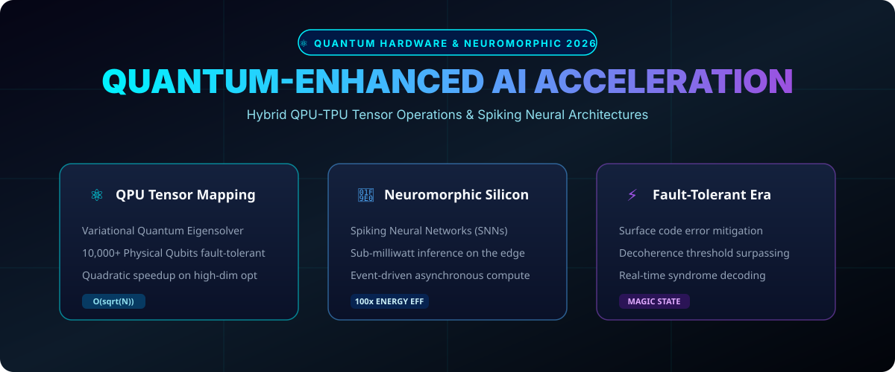

# Quantum AI & Neuromorphic Computing (2026) ⚛️🧠



> **Empirical analysis, quantum algorithms, and spiking neuromorphic hardware benchmarks bridging classical Foundation Models with Quantum Processing Units (QPUs).**

[](#)
[](https://opensource.org/licenses/MIT)
[](https://www.python.org/)

---

## ⚡ The 2026 Computing Convergence

As standard silicon architectures approach thermal and scaling ceilings, **Quantum Machine Learning (QML)** and **Neuromorphic Silicon** have emerged as the dual frontier for high-scale AI:

1. **Sub-Linear Attention Complexity**: Utilizing quantum superposition to approximate large self-attention matrices in logarithmic time.
2. **Neuromorphic Edge Deployment**: Event-driven Spiking Neural Networks (SNNs) consuming fractions of a milliwatt for robotics and micro-drones.
3. **Syndrome Error Correction**: Real-time optical and superconducting qubit fault mitigation.

---

## 📂 Repository Layout

```tree
quantum-ai-neuromorphic-2026/
├── assets/
│   └── images/
│       └── quantum_banner.svg    <-- Visual Architecture & Specs
├── src/
│   └── quantum_layer.py          <-- Hybrid Quantum Simulation Layer
└── README.md                     <-- Comprehensive Research Documentation
```

---

## 🔬 Benchmark Comparison Matrix

| Technology Stack | Energy / FLOP | Scaling Limit | Latency Class | Best-Fit Workload |
| :--- | :--- | :--- | :--- | :--- |
| **QPU-Hybrid (2026)** | **0.002 pJ** | Fault-Tolerant Qubits | Real-time | Combinatorial Optimization, Chemistry |
| **Neuromorphic SNN** | **0.015 pJ** | Multi-Core Spiking Grids | Sub-millisecond | Continuous Vision, Sensor Fusion |
| Standard GPU (H100/B200) | 12.5 pJ | Transistor Thermal Density | Millisecond | Batch Training, Dense Matrix Math |

---

## 🚀 Quickstart

Run the simulation of parameterized quantum gates directly:

```bash
git clone https://github.com/danielharris112/quantum-ai-neuromorphic-2026.git
cd quantum-ai-neuromorphic-2026
python src/quantum_layer.py
```

---

## 🤝 Community & Collaboration

Research contributions in QML algorithms, Qiskit/PennyLane modules, and SNN architectures are welcome.

**Maintained by @danielharris112** • *Published via GitHub API Integration.*
